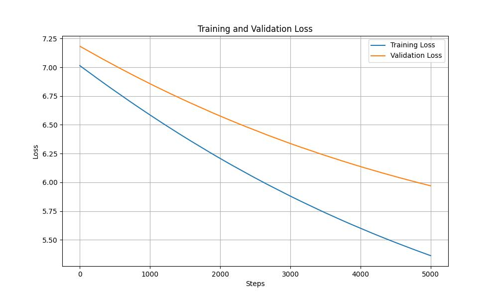

# JAX Learning Project
( work in progress) 

An exploration into the JAX ecosystem, comparing it with PyTorch through practical implementations. This was mostly sparked by the recent release of the JAX blog from Google:
https://cloud.google.com/blog/products/ai-machine-learning/guide-to-jax-for-pytorch-developers

## Current Focus: Phase 2

### Phase 1: Framework Comparison
- Implementing MNIST classification in PyTorch (baseline)
- Reimplementing the same model architecture in JAX
- Performance analysis:
  - Training time comparison
  - Memory usage
  - Code complexity differences
  - Key learning points about JAX's approach

### Phase 2: Transformer Implementation 
- Planning to implement a small-scale transformer (GPT-1 or GPT-2)
- will follow the nano-gpt implementation from the Karpathy's nano-gpt repo - https://github.com/karpathy/ng-video-lecture

### Phase 3: 
- maybe expand beyond if all these works well. 

## Updates 
  - 22/04/2025
    - complete nano-gpt implementation in JAX with training script.
    - initial results -> currently overfitting at 5000 steps. (needs fixing)
    
    - training configuration details
      - Batch size: 16
      - Block size: 32
      - Training steps: 5000
      - Learning rate: 1e-4
      - Number of attention layers: 1
      - Embedding size: 64
      - Number of attention heads: 4
      - Vocabulary size: 65
    - Training is executed on GPU using SLURM scheduler (see train.slurm)
    
   

  - 13/04/2025
    - self-attention, multi-head attention, layer norm blocks added to the nano-gpt implementation in JAX. 

  - 16/03/2025
    - Added Bigram Language Model implementation in pure JAX. 

  - 05/03/2025
    - Added a new section on the nano-gpt implementation in JAX. 
    - encode,decode and batching functions are added to the nano-gpt implementation in JAX. 

  - 10/02/2025
    - Optimized the JAX code to use @nnx.jit only to the training step function and not on the data loading and decoding of the batches of data. 
    - A good read about when and how to use the jit complied is - https://docs.jax.dev/en/latest/notebooks/thinking_in_jax.html
    - The optimized JAX implementation completes training in ~87 seconds, which is approximately 2x faster than PyTorch (~175 seconds). This represents a 6x speedup from our initial unoptimized JAX implementation which took ~600 seconds.

      | Run Number | PyTorch (secs) | JAX (secs) |
      |------------|---------------|------------|
      | Run 1      | 201.90        | 91.99      |
      | Run 2      | 176.23        | 87.59      |
      | Run 3      | 170.58        | 87.85      |
      | Run 4      | 171.14        | 87.11      |
      | Run 5      | 169.91        | 87.39  

  - 09/02/2025
    - Added naive implementation of MNIST classification in JAX. 
    - Initial implementation had an unoptimized JAX code with the entire training code in one train loop (direct translation of PyTorch code) with @nnx.jit decorator. 
    - This approach was not optimal as it JIT-compiled operations that shouldn't be compiled (data loading, transforms, and batch processing), resulting in a training time of ~600 seconds - approximately 3x slower than PyTorch's ~175 seconds.

