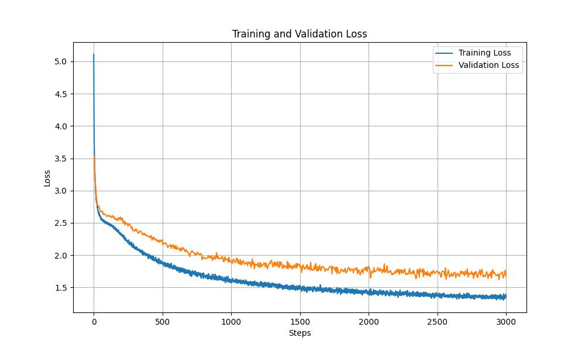

# JAX Learning Project
( work in progress) 

This repo consists of smaller projects that I am working on in order to learn JAX and its ecosystem. The general struture is that each folder is a self-contained project on it's own but they may be inter connected in some cases.

Currently, this includes:

- optimizers -- Implementaion of the Muon optimizer in Optax. My implementation and understanding follows from these great write ups by the authors/researchers associated with it: [Laker/Newhouse](https://www.lakernewhouse.com/writing/muon-1), [Jeremy Bernstein](https://jeremybernste.in/writing/deriving-muon), and [Keller Jordan](https://kellerjordan.github.io/posts/muon/).

- nano_gpt -- I thought of implementing the character level nano-gpt codebase by Karpathy (see the [video](https://www.youtube.com/watch?v=kCc8FmEb1nY) and the original [PyTorch code](https://github.com/karpathy/ng-video-lecture)) in JAX without using any of its libraries and mostly with jnp arrays. This turned out to be a great way to understand many core philosophies of JAX. Some interesting reads here: [Neel Gupta](https://neel04.github.io/my-website/blog/pytorch_rant/), [Kidger](https://kidger.site/thoughts/torch2jax/)

 - mnist -- A simple CNN on MNIST which compares the same model in PyTorch and JAX, mostly uses higher-level libraries like Flax. 


## Updates

### updated the nano-gpt code with muon optimizer



  - Generated examples:

     ```
    KENwYour AXking:
    What I wull what I hAP have Even took our hasters'd and miscranger.

    KING ROTHER:
    Yhat?

    QUEEN Ergrand what I GARENTER:
    Shall kungue?

    KINGHAM:
    Ahtletand Kow hearth?

    RICHARD ESTA:
    OpK:
    And with thy farmilque,
    Furself:
    Thou GoRO:
    What and their ceatired they bark?

    VINING
    RETCUS:
    Whow Chall what ARDTIO:
    I shall hath form what a I'll Axguing I'll warderses.

    BENTUS:
    Awaking letting IA:
    In I
     ```


### nano-gpt train results


  - Generated examples:

      ```
      OFRCUTOLYCUS:LORD:
      I wash lie; if I do caTse heart him in excle.

      KING RICHESRY:
      You hath blood men, I let me with his sea.

      DUKE VINCENTIO:
      More say, him sight, and him saidst the lean service
      And which in his subject. O this sock'd he say, hence you enter'd
      Him and pity cimpassion-in him in him.

      AAUTOLYCUS:
      You have she but them by other black'd oppears to expless' chavise
      And and Georgest in place the sovereign
      Second than partlyso more and more harms: what
      thou he'll'd they crouds, I'll not
      ```

### mnist pytorch vs jax code 
 (on same gpu)

      | Run Number | PyTorch (secs) | JAX (secs) |
      |------------|---------------|------------|
      | Run 1      | 201.90        | 91.99      |
      | Run 2      | 176.23        | 87.59      |
      | Run 3      | 170.58        | 87.85      |
      | Run 4      | 171.14        | 87.11      |
      | Run 5      | 169.91        | 87.39  

